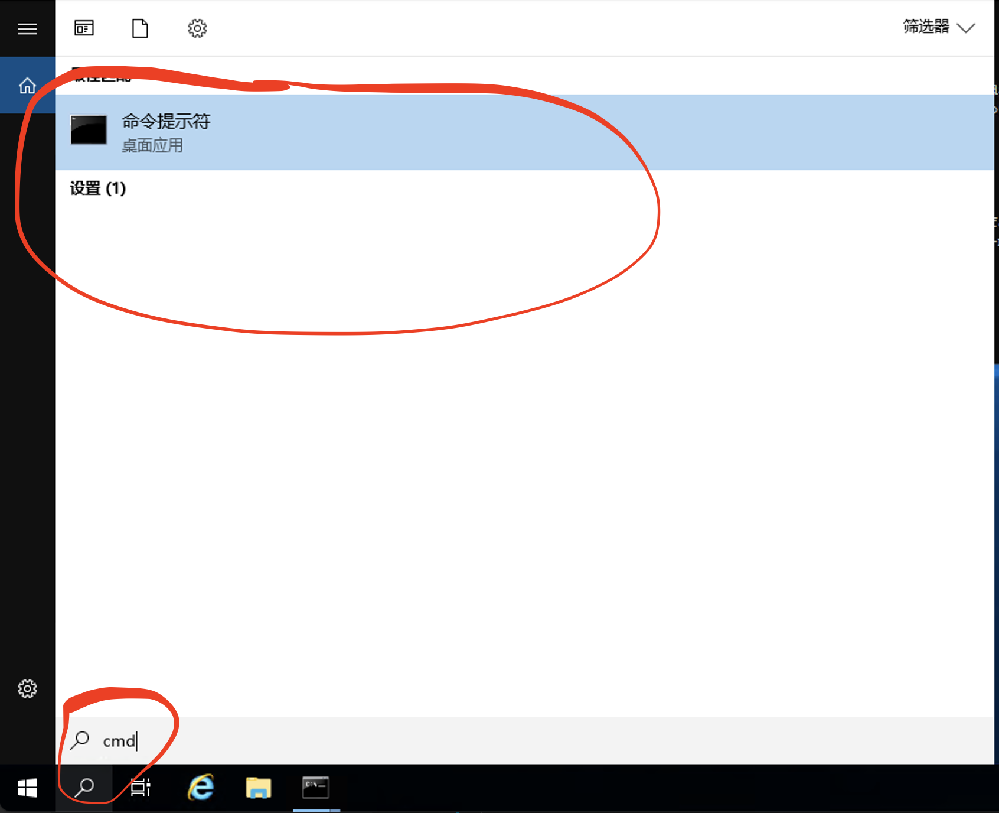
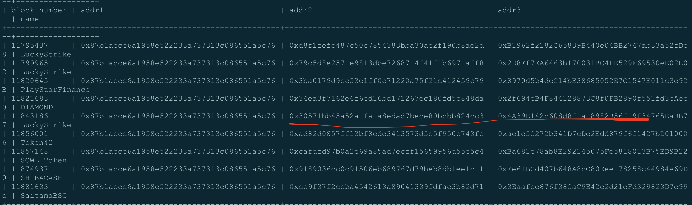
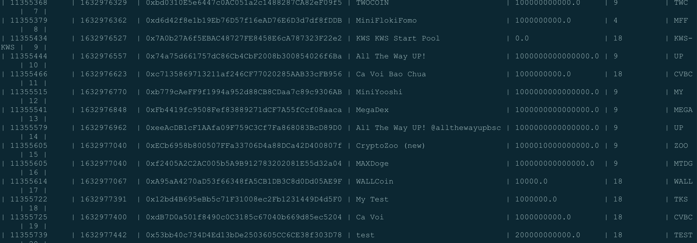

# 工具使用说明（仅限30人，多了内卷）
## 工具介绍
  1. 普通版：基本抢币功能，抢预售，支持dxsale，pinksale，feg预售平台，以及直接转账式预售
  2. 高级版：具有防硬核貔貅，防燃烧，防黑名单的功能
  3. 合约：扒合约，合约信息咨询服务  
**普通版和高级版是独立关系，不存在包含关系**

4. 下图是在windows上打开cmd

## 普通版 0.6BNB/月
### 购买方式
1. 打开[官网链接](https://app.dreamdoge.finance/tools/presale)
1. 链接钱包，点击购买。该账户为你的主账户钱包
1. 设置调用者钱包。每个主账户可同时设置两个调用者钱包，意味着你同时可以抢多个币，多个预售。调用者钱包可随时更改。
### 抢币使用说明
该种模式，需要在调用者钱包存入bnb。**抢到的币在主账户钱包里**
  ```
Options:
  -V, --version                    output the version number
  -n, --node <websocket>           设置节点链接 (default: "https://bsc-dataseed1.binance.org/")
  -k, --key <private key>          设置GAS钱包私钥
  -t0, --token0 <pair>             设置交易对代币 (default: "BNB")
  -t1, --token1 <target address>   设置目标代币
  -a, --amount <amount>            设置购买数量
  -c, --count <amount>             设置购买次数 (default: 1)
  -p, --gasPrice <gasPrice>        设置gas price (default: "5")
  -l, --gasLimit <gasLimit>        设置gas limit (default: 10000000)
  -m, --mainAccount <mainAccount>  设置主账户
  -q, --liq <liq>                  设置池子大小(仅用于轮询模式)
  -i, --interval <interval>        设置交易提交间隔时间(毫秒)(仅用于燃烧模式) (default: 2000)
  -s, --startTime <startTime>      设置开始时间(比真正预售时间稍微早3秒，YYYY-MM-DD hh:mm:ss)
  -h, --help                       display help for command

Commands:
  burn                             燃烧模式
  loop                             轮询模式
  ```
#### 使用案例  
##### 轮询模式
合约为0xA77346760341460B42C230ca6D21d4c8E743Fa9c，交易对为BNB，购买数量为0.01BNB，gas价格为6gwei，最大gas为1000000，购买1次，当流动超过1时执行买入操作
```
C:\Users\Administrator\Desktop\NormalSniperMain-win.exe -k 调用者私钥 -t0 BNB -t1 0xA77346760341460B42C230ca6D21d4c8E743Fa9c -a 0.01 -c 1 -p 6 -l 1000000 -m 0x0883aED723EAeD44faD583d49Ad5d412505a8888 -q 1 loop
```

##### 轮询模式
合约为0xA77346760341460B42C230ca6D21d4c8E743Fa9c，交易对为USDT，购买数量为0.01BNB，gas价格为6gwei，最大gas为1000000，在2021-10-18 22:59:01时，尝试购买10次，每隔2秒执行一次
```
C:\Users\Administrator\Desktop\NormalSniperMain-win.exe -k 调用者私钥 -t0 USDT -t1 0xA77346760341460B42C230ca6D21d4c8E743Fa9c -a 0.01 -c 10 -p 6 -l 1000000 -m 0x0883aED723EAeD44faD583d49Ad5d412505a8888 -i 2000 -s "2021-10-18 22:59:01" burn
```

### 抢预售说明
```
Options:
  -V, --version                    output the version number
  -n, --node <websocket>           设置节点链接 (default: "https://bsc-dataseed1.binance.org/")
  -m, --mainAccount <mainAccount>  设置主账户
  -k, --key <private key>          设置GAS钱包私钥
  -t, --token <pair>               设置预售地址
  -a, --amount <amount>            设置购买数量
  -p, --gasPrice <gasPrice>        设置gas price (default: "5")
  -l, --gasLimit <gasLimit>        设置gas limit (default: 10000000)
  -mf, --maxFailed <maxFailed>     设置最大失败次数 (default: 10)
  -feg, --feg <feg>                是否是FEG预售 (default: false)
  -i, --interval <interval>        设置交易提交间隔时间(毫秒)(仅用于燃烧模式) (default: 2000)
  -s, --startTime <startTime>      设置开始时间(比真正预售时间稍微早3秒，YYYY-MM-DD hh:mm:ss)
  -h, --help                       display help for command

Commands:
  presale                          参与预售
  help [command]                   display help for command
```

#### 使用案例
##### pinksale，dxsale，直接转账式
预售合约地址为0x62107d1c7BE382AfAa37EE22875f6a0ddFBe6Bc5，购买2个BNB，gas价格100gwei，最大gas500000，在2021-10-18 21:59:51时，每隔2秒提交交易，尝试8次
```
C:\Users\Administrator\Desktop\PresaleMain-win.exe -m 0x0883aED723EAeD44faD583d49Ad5d412505a8888 -k 调用者私钥 -t 0x62107d1c7BE382AfAa37EE22875f6a0ddFBe6Bc5 -a 2 -p 100 -l 500000 -mf 8 -feg false -i 2000 -s "2021-10-18 21:59:51" presale
```

##### FEG预售平台（可以提供预售合约地址）
预售合约地址为0x62107d1c7BE382AfAa37EE22875f6a0ddFBe6Bc5，购买2个BNB，gas价格100gwei，最大gas500000，在2021-10-18 21:59:51时，每隔2秒提交交易，尝试8次
```
C:\Users\Administrator\Desktop\PresaleMain-win.exe -m 0x0883aED723EAeD44faD583d49Ad5d412505a8888 -k 调用者私钥 -t 0x62107d1c7BE382AfAa37EE22875f6a0ddFBe6Bc5 -a 2 -p 100 -l 500000 -mf 8 -feg true -i 2000 -s "2021-10-18 21:59:51" presale
```

## 高级版 存入时会被扣取10%
### 购买方式
1. 打开[官网链接](https://app.dreamdoge.finance/tools/sniper)
1. 链接钱包，生成专属合约地址
1. 设置GAS钱包地址，可以设置无数个
1. 向合约存入BNB，此时会被收取10%手续费
### 抢币使用说明
该种模式，需要在合约里存入bnb。**抢到的币在合约里，卖出，提取需在官网操作**
```
  -V, --version                     output the version number
  -n, --node <websocket>            设置节点链接 (default: "https://bsc-dataseed1.binance.org/")
  -k, --key <private key>           设置GAS钱包私钥
  -t0, --token0 <pair>              设置交易对代币 (default: "BNB")
  -t1, --token1 <target address>    设置目标代币
  -a, --amount <amount>             设置购买数量
  -c, --count <amount>              设置购买次数 ，针对于单笔限购(default: 1)
  -p, --gasPrice <gasPrice>         设置gas price (default: "5")
  -l, --gasLimit <gasLimit>         设置gas limit (default: 10000000)
  -b, --bot <bot>                   设置专属合约地址
  -bp, --burnPercent <burnPercent>  设置可接受燃烧比例
  -mf, --maxFailed <maxFailed>      设置最大失败次数 (default: 1)
  -q, --liq <liq>                   设置池子大小(仅用于轮询模式)
  -i, --interval <interval>         设置交易提交间隔时间(毫秒) (default: 2000)
  -s, --startTime <startTime>       设置开始时间(比真正开始时间稍微早6秒，YYYY-MM-DD hh:mm:ss)
  -h, --help                        display help for command

Commands:
  burn                              燃烧模式
  loop                              轮询模式
  help [command]                    display help for command
```
#### 使用案例
##### 轮询模式
代币合约为0x47ec15a277b66e70B1D0413465f4FAD8Bf660e1f，专属合约地址为0xa5349E3c898CA51836BAf68a8fD7FEbDA548B91E，交易对为BNB，每次买入0.01BNB，买入4笔（该4笔将在同一个交易中买入），gas价格6gwei，最大gas10000000，可接受60%代币燃烧，池子代币数量超过1时，每隔3秒，提交一笔交易，最多提交2次
```
C:\Users\Administrator\Desktop\SpecialSniperMain-win.exe -k GAS钱包私钥 -b 0xa5349E3c898CA51836BAf68a8fD7FEbDA548B91E -t0 BNB -t1 0x47ec15a277b66e70B1D0413465f4FAD8Bf660e1f -a 0.01 -c 4 -p 6 -l 10000000 -bp 60 -q 1 -i 3000 -mf 2 loop
```
##### 燃烧模式
代币合约为0x47ec15a277b66e70B1D0413465f4FAD8Bf660e1f，专属合约地址为0xa5349E3c898CA51836BAf68a8fD7FEbDA548B91E，交易对为BUSD，每次买入0.01BNB，买入4笔（该4笔将在同一个交易中买入），gas价格6gwei，最大gas10000000，可接受60%代币燃烧，在2021-10-18 17:45:00时，每隔3秒，提交一笔交易，最多提交2次
```
C:\Users\Administrator\Desktop\SpecialSniperMain-win.exe -k GAS钱包私钥 -b 0xa5349E3c898CA51836BAf68a8fD7FEbDA548B91E -t0 BUSD -t1 0x47ec15a277b66e70B1D0413465f4FAD8Bf660e1f -a 0.01 -c 4 -p 6 -l 10000000 -bp 60 -i 3000 -mf 2 -s "2021-10-18 17:45:00" burn
```

## 合约咨询 免费
1. 提供合约分析服务，针对合约，给出参数配置
2. 扒合约，扒FEG预售地址
下图是在FEG预售的LuckyStrike，预售地址很早就被记录下来了

3. 下图是在BSC上所有新建的erc20代币合约
